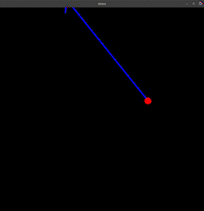
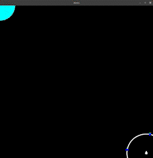

# Introduction

This project provides a generic framework enabling users to create GPU accelerated SIR particle filters using CUDA and provides facilities for exposing these particle filters as native Python modules.

There are many real-time nonlinear state estimation applications for which Kalman Filters (KFs) and Extended Kalman Filters (EKFs) are inadequate. These applications include those for which the respective latent state space distributions have multiple modes as well as applications for which the respective conditional measurement likelihood distributions are non-guassian. By comparison, particle filters can represent arbitrary latent space distributions and impose no limitations on one's choice of conditional measurement likelihood distribution. This flexibility comes with a hefty computational cost which has traditionally largely excluded particle filters from consideration in real-time nonlinear state estimation applications. This project seeks to address the challenges posed by this computational cost with a work efficient GPU accelerated particle filter implementation which enables millions of particles to be processed in real-time. A key component in the provided GPU accelerated particle filter implementation is a novel parallel systematic resampling algorithm which does not suffer from thread divergence even when processing pessimal/extremely degenerate particle distributions.

# Demos

Both to demonstrate the capabilities of this project and to serve as reference implementations when adding custom particle filters, two example particle filters are provided: a first order linear motion model `point` particle filter and a `plate_orbit` particle filter estimating the state of a rotating+translating robot with vision markers located around its perimeter. Interactive scripts demonstrating these two example particle filters can be found under the `demos` directory. Below are real-time demonstrations of both the provided reference `point` and `plate_orbit` particle filters with 1M particles each respectively.


<div align="center">


</div>


# Building a Wheel
- Initialize submodules with `git submodule update --init --recursive`.
- Ensure required build tools are installed (see `pyproject.toml`) and CUDA is installed.
- Run `python setup.py bdist_wheel`, using the python version you intend to target.
- Install the wheel with `python -m pip install dist/particle_filter*.whl` using the same python version you used in the previous step.

# Consuming as a Header-only CUDA Library

Given `nvcc` lacks link time optimization support, this project is header-only for performance reasons. A convenient side effect of this is that the project can be easily consumed as a header-only CUDA library targeting c++17. When integrating with an existing c++ project, it will almost always be desirable to isolate the rest of your project from CUDA by way of wrapping template instantiations of the provided [`filter::particle_filter`](include/filter/particle_filter.h) template class using the PImpl idiom. See [this](#3-implement-pimpl-wrapper) step for more specifics regarding wrapping template instantions of the [`filter::particle_filter`](include/filter/particle_filter.h) template class using the PImpl idiom.

# Adding Custom Particle Filters

Unfortunately, adding a custom particle filter is currently a relatively involved process owing primarily to an unwillingness to compromise on performance nor compromise on flexibility. Outlined below are the steps required to add a custom particle filter using this library. The provided [`point`](/include/point) particle filter should serve as reference throughout this process.

At a high level, this project provides a [`filter::particle_filter`](include/filter/particle_filter.h) template class which accepts a user provided `ParticleFilterConfiguration` template type argument. The user provided `ParticleFilterConfiguration` type must define a prediction/hidden state type and an observation/measurement type. Additionally, the user provided `ParticleFilterConfiguration` type must define how to compute the conditional log-likelihood of a measurement given a particle, apply a hidden state transition to a particle, sample particles given a measurement (used for initialization) and reduce particles to obtain an overall prediction. The [`filter::particle_filter`](include/filter/particle_filter.h) template class relies on the definitions provided by the user's `ParticleFilterConfiguration` template type argument to implement optimized predict, update and resample steps for the user's desired application.


## 1. Define `observation` and `prediction`

Your chosen `observation` and `prediction` types correspond to the measurement state and particle/hidden state for your application respectively. The only requirements to implement these concepts is that `prediction` defines an `extrapolate_state` member function which returns the hidden state estimated by the prediction after `t` seconds have elapsed and that `prediction` be default constructible. The following defines the exact constraints using concept syntax:

```cpp
template <typename T>
concept Observation = requires(T) {};

template <typename T>
concept Prediction = requires(const T p, const float t) {
  { T() } -> T;
  { p.extrapolate_state(t) } -> T;
};
```

Importantly, `prediction`'s default constructor must be a `__device__` function. See [`include/point/observation.h`](include/point/observation.h) and [`include/point/prediction.h`](include/point/prediction.h) for reference observation and prediction implementations respectively.

## 2. Implement `particle_filter_configuration`

Next, you'll need to define the `particle_filter_configuration` type for your application which is used to instantiate the provided [`filter::particle_filter`](include/filter/particle_filter.h) template class. The `particle_filter_configuration` type must define the required member functions to instantiate the [`filter::particle_filter`](include/filter/particle_filter.h) template class. Specifically, you'll need to define how to compute the conditional log-likelihood of a measurement given a particle, apply your hidden state transition function to a particle, sample particles given a measurement (used for initialization) and reduce particles to obtain an overall prediction.

- `particle_filter_configuration::apply_process`: applies the hidden state transition function to a particle in-place.
- `particle_filter_configuration::sample_from`: samples particle states given a single measurement.
- `particle_filter_configuration::conditional_log_likelihood`: computes the log-likelihood of a measurement given a particle (i.e, assuming the particle corresponds the ground truth hidden state).
- `particle_filter_configuration::most_likely_particle_reduction`: provides a binary reduction over particles to obtain the most likely hidden state.

 The following defines the exact constraints outlined above using concept syntax:

```cpp

template <typename T, Prediction P>
concept ParticleReductionOperation = requires(
  const T op, 
  const particle_reduction_state<P> a, 
  const particle_reduction_state<P> b) {
  { op(a, b) } -> particle_reduction_state<P>;
};

template <typename T>
concept ParticleFilterConfiguration = requires(
  const T c,
  const float t,
  util::default_rv_sampler s,
  const typename T::observation_type o, 
  typename T::prediction_type p) {

  requires Observation<typename T::observation_type>;
  requires Prediction<typename T::prediction_type>;

  { c.apply_process(t, s, p) } -> typename T::prediction_type;
  { c.sample_from(s, o) } -> typename T::prediction_type;
  { c.conditional_log_likelihood(std::as_const(s), p, o) } -> float;
  { c.most_likely_particle_reduction() } -> ParticleReductionOperation<typename T::prediction_type>;
};

```

Notably, the `particle_filter_configuration::apply_process`, `particle_filter_configuration::sample_from`, and `particle_filter_configuration::conditional_log_likelihood` member functions outlined above must be `__device__` functions. Additionally, your `ParticleReductionOperation::operator()` must also be a device function.

See [`include/point/particle_filter_configuration.h`](include/point/particle_filter_configuration.h) for a reference implementation.

## 3. Implement PImpl wrapper

Even if you're consuming this project as a header-only library, you'll likely want to isolate the rest of your project from CUDA. Hence, wrapping the instantiated [`filter::particle_filter`](include/filter/particle_filter.h) template class using the PImpl pattern to decouple the implementation details from the object representation will likely be desirable. Assuming your `particle_filter_configuration`s constructor takes only `particle_filter_configuration_params` as an argument, the PImpl boilerplate should look something like the following:


```cpp
// particle_filter.h

class particle_filter {
 private:
  struct impl;

  struct impl_deleter {
    void operator()(impl* p_impl);
  };

  std::unique_ptr<impl, impl_deleter> p_impl_;

 public:
  [[nodiscard]] prediction extrapolate_state(const float& time_offset_seconds) const noexcept;

  void update_state_sans_observation(const float& time_offset_seconds) noexcept;
  void update_state_with_observation(const float& time_offset_seconds, const observation& observation_state) noexcept;

  particle_filter(
      const std::size_t& number_of_particles,
      const observation& initial_observation,
      const particle_filter_configuration_parameters& params) noexcept;
};

```

```cpp
// particle_filter.cu

struct particle_filter::impl : public filter::particle_filter<particle_filter_configuration> {
 public:
  template <typename... Ts>
  impl(Ts&&... ts) : filter::particle_filter<particle_filter_configuration>(std::forward<Ts>(ts)...) {}
};

void particle_filter::impl_deleter::operator()(particle_filter::impl* p_impl) { delete p_impl; }

prediction particle_filter::extrapolate_state(const float& time_offset_seconds) const noexcept {
  return p_impl_->extrapolate_state(time_offset_seconds);
}

void particle_filter::update_state_sans_observation(const float& time_offset_seconds) noexcept {
  p_impl_->update_state_sans_observation(time_offset_seconds);
}

void particle_filter::update_state_with_observation(
    const float& time_offset_seconds,
    const observation& observation_state) noexcept {
  p_impl_->update_state_with_observation(time_offset_seconds, observation_state);
}

particle_filter::particle_filter(
    const std::size_t& number_of_particles,
    const observation& initial_observation,
    const particle_filter_configuration_parameters& params) noexcept
    : p_impl_(new particle_filter::impl(number_of_particles, initial_observation, params)) {}
```

See [`include/point/particle_filter.h`](include/point/particle_filter.h) and [`src/point/particle_filter.cu`](src/point/particle_filter.cu) for reference implementations.

## 4. [Optional] Define Python bindings

If you wish to expose your custom particle filter as a native python module, you'll need to define bindings using `pybind11`. Specifically, you'll need to implement an `init` function which takes a `pybind11::module_` and adds a submodule with the desired bindings for your custom particle filter (see [`src/point/init.cc`](src/point/init.cc) for reference). Finally, you'll need to add an invocation of your `init` function to [`src/particle_filter/particle_filter.cc`](src/particle_filter/particle_filter.cc). 

Additionally, you can optionally define type stubs for your custom particle filter (see [`src/particle_filter/point.pyi`](src/particle_filter/point.pyi) and [`src/particle_filter/__init__.pyi`](src/particle_filter/__init__.pyi) for reference).